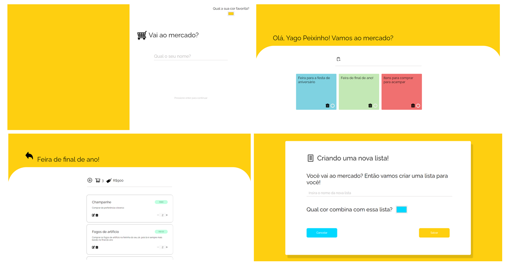
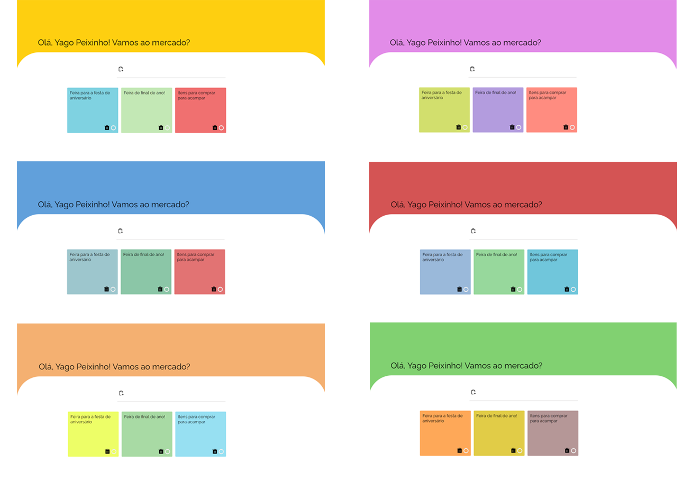
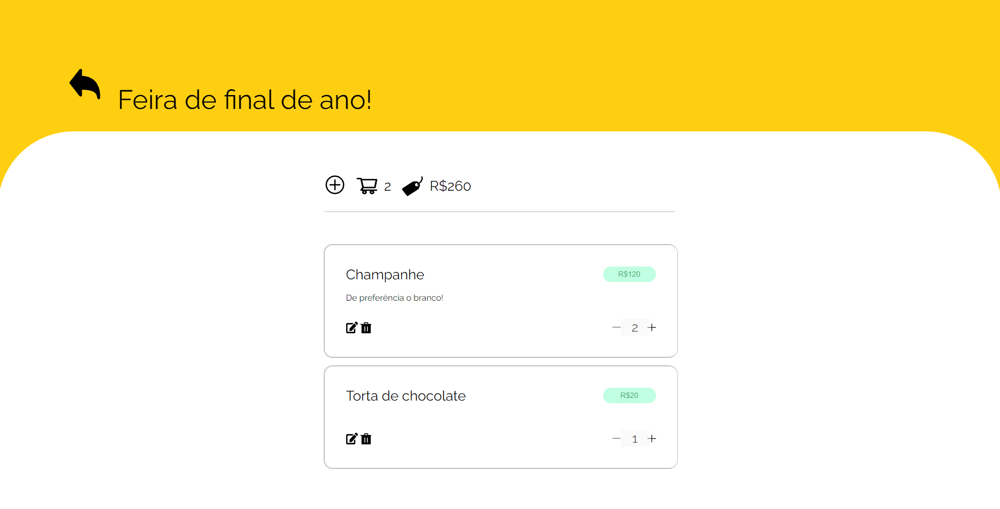

<div align="center">
<a href="https://vouaomercado.netlify.app" target="_blank"><p align="center"></p></a>

 <br>
 <br>
 
 **vouAoMercado!** é um aplicativo para pessoas (assim como eu) que sempre esquecem algo quando vão ao mercado. Alface, ketchup, manteiga... Nenhum desses   itens serão esquecidos novamente!



</div>
 <br>
 
 <div align="center">

# Sobre o projeto

</div>

Em uma sociedade em que consumimos cada vez mais informação, está se tornando cada vez mais
dificil lembrarmos dos pequenos detalhes do dia a dia – isso também é sentindo quando vamos
ao mercado! Nunca mais esqueça de algo ao utilizar o **vouAoMercado!**

Além de conseguir personalizar as cores do sistema e listas, você pode também gerenciar suas listas e produtos, também é sendo capaz de saber o valor total e adicionar lembretes para cada produto.

<br>
 
 <div align="center">

## Galeria

<br>

### Responsive Layout


<br>

### Personalize da forma que você quiser!



<br>

### Saiba o valor total da sua lista e a quantidade de itens



  </div>

<br>

## Por que esse projeto existe?

Esse projeto nasceu como uma necessidade pessoal de modo em que sempre que eu vou ao mercado eu acabo esquecendo algo. Entretanto, após comentar com alguns amigos e pessoas da comunidade de desenvolvimento de software, eu decedi tornar esse projeto um repositório público.

## Notas do projeto

- Esse projeto armazena as informações no _localStorage_, ou seja, as informações são salvas diretamente no seu navegador, desse modo, ao limpar o cache, todas as informações desaparecem

- Em algumas telas é indicado um _input color_ sugerindo a cor de algum item. É fortemente recomendado que você use cores de tons pastéis e evite cores muito saturadas

## Como rodar o projeto?

### Pré-requisitos

Antes de começar, você vai precisar ter instalado em sua máquina o git . Além disto é bom ter um editor para trabalhar com o código como Visual Studio Code.

### Clonando o repositório

```bash
# Clone este repositório
$ git clone git@bitbucket.org:seno-ti/exporevestir-frontend.git
```

### Executar o servidor

Executar o servidor ou use um plugin que criar um servidor.

## Contato

Se você gostou do projeto, tem alguma crítica construtiva ou quer entrar em contato por qualquer outro motivo. Abaixo tem algumas opções:

- 🌎 Compartilhe esse repositório com seus amigos :D
- ⭐ Se gostou da ideia você pode fazer um fork ou favoritar o projeto
- 📬 Me envie um e-mail caso você precise de algo: peixinhoyago@gmail.com

## Autor

<table align="center">
<tr>
   <td align="center"> 
		<a href="https://github.com/yagopeixinho">
			      
<br/>  
		<sub>
					<b>Yago Peixinho</b>
		</sub>
		</a> 
	</td> 
</tr>
   </table>
