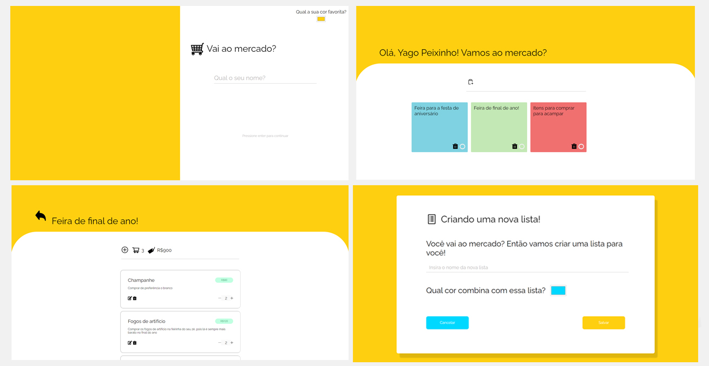
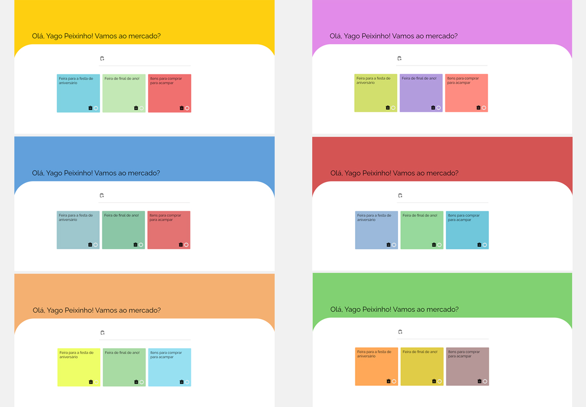

<h1 align="center">
   
  
   
</h1>

<h4 align="center">Gerencie suas listas de produtos e jamais esqueça algo ao ir ao mercado novamente.</h4>

  
   
         
  

  <a href="#sobre-o-projeto">Sobre o projeto</a> • 
  <a href="#porque-esse-projeto-existe">Porque esse projeto existe</a> • 
  <a href="#algumas-observações-sobre-o-projeto">Observações sobre o projeto</a> •
  <a href="#principais-características">Principais características</a>

## Sobre o Projeto

Em uma sociedade em que consumimos cada vez mais informação, está se tornando cada vez mais dificil lembrarmos dos pequenos detalhes... Isso é refletido quando vamos ao mercado e sempre esquecemos de algo. O **vouAoMercado!** surgiu com o propósito de resolver esse problema sendo um gerenciador de listas para usar quando você ao mercado, garantindo que você não nunca mais esqueça daquele leite, morango ou café.

## Porque esse Projeto Existe?

A princípio esse projeto nasceu como uma necessidade pessoal, pois sempre que eu ia ao mercado eu acabava esquecendo algo. Entretanto, eu percebi que poderia tornar

esse projeto uma solução coletiva, pois após conversar com alguns amigos pessoais e desenvolvedores, eu percebi que muitas pessoas também lidam com esse problema de esquecimento.

Além disso, você pode utilizar esse projeto como desejar, seja estudar, fazer melhorias ou utilizar da forma como desejar!

## Algumas Observações sobre o Projeto

- Esse projeto armazena as informações no _localStorage_, ou seja, as informações são salvas diretamente no seu navegador, desse modo, ao limpar o cache, todas as informações desaparecem.

- Em algumas telas é indicado um _input color_, sugerindo a cor de alguma interface. É _fortemente recomendado_ que você use cores de tons pastéis e evite cores muito saturadas para que você tenha uma melhor experiência visual.

## Principais Características

- Visão em tempo real
  - Veja de forma instantânea os novos itens e os valores em tempo real ao adicionar ou excluir um produto.
- Interface amigável
- Livre personalização
  - Escolha as suas cores favoritas do sistema e torne o 🛒vouAoMercado! cada vez mais a sua cara!
- Não possui sistema de autenticação
  - Acesso sem burocracia pois não precisa fazer login nem criar conta para acessar.
- Layout responsivo
- Criação completa de listas e itens
  - Crie uma lista, escolha a cor e o nome;
  - Crie itens com nome, descrição, valor e quantidade;
  - Tenha em tempo real o valor total dos itens da listas e a quantidade de produtos.

 

## Galeria

### Layout responsivo

 

### Algumas telas do vouAoMercado!

 

### Personalize da forma que você quiser!

